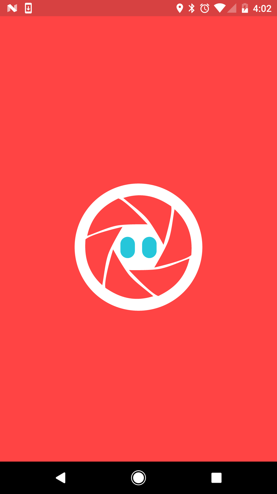
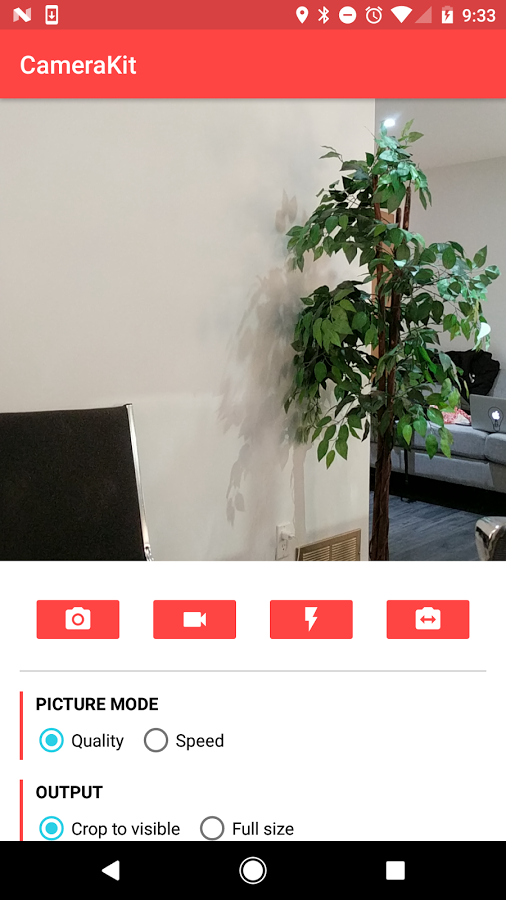
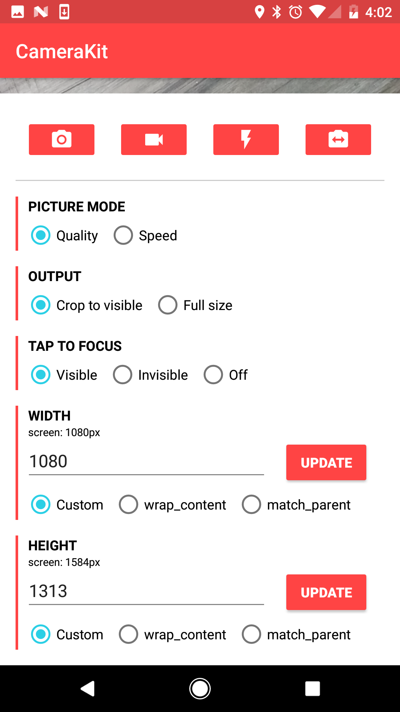
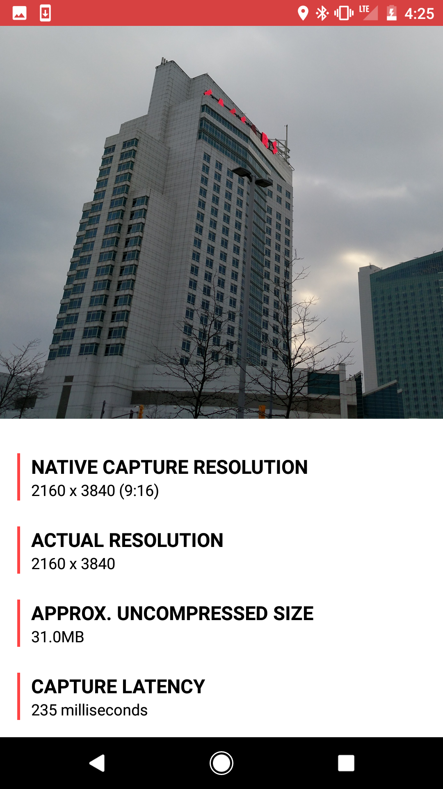
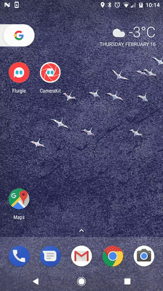

##### Originally a fork of [Google's CameraView library](https://github.com/google/cameraview).

CameraKit is an extraordinarily easy to use utility to work with the infamous Android Camera and Camera2 APIs. Built by [Dylan McIntyre](https://github.com/dwillmc).

Try out all the unique features using the CameraKit Demo from the Google Play store!

<a href='https://play.google.com/store/apps/details?id=com.flurgle.camerakit.demo&pcampaignid=MKT-Other-global-all-co-prtnr-py-PartBadge-Mar2515-1'></a>

   

## Table of Contents

- [Features](#features)
- [Setup](#setup)
- [Usage](#usage)
  - [Capturing Images](#capturing-images)
  - [Capturing Video](#capturing-video)
- [Extra Attributes](#extra-attributes)
  - [`ckFacing`](#ckfacing)
  - [`ckFlash`](#ckflash)
  - [`ckFocus`](#ckfocus)
  - [`ckMethod`](#ckmethod)
  - [`ckZoom`](#ckzoom)
  - [`ckCropOutput`](#ckcropoutput)
  - [`ckJpegQuality`](#ckjpegquality)
- [Automatic Permissions Behavior](#automatic-permissions-behavior)
- [Dynamic Sizing Behavior](#dynamic-sizing-behavior)
  - [`adjustViewBounds`](#adjustviewbounds)
- [Events](#events)
- [Credits](#credits)
- [License](#license)

## Features

- Image and video capture seamlessly working with the same preview session.
- Automatic system permission handling.
- Automatic preview scaling.
  - Create a `CameraView` of any size (not just presets!).
  - Automatic output cropping to match your `CameraView` bounds.
- Multiple capture methods.
  - `METHOD_STANDARD`: an image captured normally using the camera APIs.
  - `METHOD_STILL`: a freeze frame of the `CameraView` preview (similar to SnapChat and Instagram) for devices with slower cameras.
  - **Coming soon:** `METHOD_SPEED`: automatic capture method determination based on measured speed.
- Built-in continuous focus.
- Built-in tap to focus.
- **Coming soon:** Built-in pinch to zoom.

## Setup

Add __CameraKit__ to the dependencies block in your `app` level `build.gradle`:

```groovy
compile 'com.flurgle:camerakit:0.9.17'
```

## Usage

To use CameraKit, simply add a `CameraView` to your layout:

```xml
<com.flurgle.camerakit.CameraView
    android:id="@+id/camera"
    android:layout_width="match_parent"
    android:layout_height="wrap_content"
    android:adjustViewBounds="true" />
```

Make sure you override `onResume` and `onPause` in your activity, and make calls respectively to `CameraView.start()` and `CameraView.stop()`.

```java
@Override
protected void onResume() {
    super.onResume();
    cameraView.start();
}

@Override
protected void onPause() {
    cameraView.stop();
    super.onPause();
}
```

### Capturing Images

To capture an image just call `CameraView.captureImage()`. Make sure you setup a `CameraListener` to handle the image callback.

```java
camera.setCameraListener(new CameraListener() {
    @Override
    public void onPictureTaken(byte[] picture) {
        super.onPictureTaken(picture);

        // Create a bitmap
        Bitmap result = BitmapFactory.decodeByteArray(picture, 0, picture.length);
    }
});

camera.captureImage();
```

### Capturing Video

To capture video just call `CameraView.startRecordingVideo()` to start, and `CameraView.stopRecordingVideo()` to finish. Make sure you setup a `CameraListener` to handle the video callback.

```java
camera.setCameraListener(new CameraListener() {
    @Override
    public void onVideoTaken(File video) {
        super.onVideoTaken(video);
        // The File parameter is an MP4 file.
    }
});

camera.startRecordingVideo();
camera.postDelayed(new Runnable() {
    @Override
    public void run() {
        camera.stopRecordingVideo();
    }
}, 2500);
```

## Extra Attributes

```xml
<com.flurgle.camerakit.CameraView xmlns:camerakit="http://schemas.android.com/apk/res-auto"
    android:id="@+id/camera"
    android:layout_width="match_parent"
    android:layout_height="wrap_content"
    camerakit:ckFacing="back"
    camerakit:ckFlash="off"
    camerakit:ckFocus="continuous"
    camerakit:ckMethod="standard"
    camerakit:ckZoom="pinch"
    camerakit:ckPermissions="strict"
    camerakit:ckCropOutput="true"  
    camerakit:ckJpegQuality="100"
    camerakit:ckVideoQuality="480p"
    android:adjustViewBounds="true" />
```

|Attribute|Values|Default Value|
|---------|------|-------------|
|[`ckFacing`](#ckfacing)|[`back`](#back) [`front`](#front)|`back`|
|[`ckFlash`](#ckflash)|[`off`](#off) [`on`](#on) [`auto`](#auto)|`off`|
|[`ckFocus`](#ckfocus)|[`off`](#off-1) [`continuous`](#continuous) [`tap`](#tap)|`continuous`|
|[`ckMethod`](#ckmethod)|[`standard`](#standard) [`still`](#still) [`speed`](#speed)|`standard`|
|[`ckZoom`](#ckzoom)|[`off`](#off-2) [`pinch`](#pinch)|`off`|
|[`ckPermissions`](#ckpermissions)|[`strict`](#strict) [`lazy`](#lazy) [`picture`](#picture`)|`strict`|
|[`ckCropOutput`](#ckcropoutput)|[`true`](#true) [`false`](#false)|`false`|
|[`ckJpegQuality`](#ckjpegquality)|[`0 <= n <= 100`](#ckjpegquality)|`100`|
|[`ckVideoQuality`](#ckvideoquality)|[`max480p`](#max480p) [`max720p`](#max720p) [`max1080p`](#max1080p) [`max2160p`](#max2160p) [`highest`](#highest) [`lowest`](#lowest)|`max480p`|

- - -

### `ckFacing`
[`back`](#back) [`front`](#front)

#### `back`

```java
cameraView.setFacing(CameraKit.Constants.FACING_BACK);
```

#### `front`

```java
cameraView.setFacing(CameraKit.Constants.FACING_FRONT);
```

- - -

### `ckFlash`
[`off`](#off) [`on`](#on) [`auto`](#auto) [`torch`](#torch)

#### `off`

```java
cameraView.setFlash(CameraKit.Constants.FLASH_OFF);
```

#### `on`

```java
cameraView.setFlash(CameraKit.Constants.FLASH_ON);
```

#### `auto`

```java
cameraView.setFlash(CameraKit.Constants.FLASH_AUTO);
```

#### `torch`
```java
cameraView.setFlash(CameraKit.Constants.FLASH_TORCH);
```

- - -

### `ckFocus`
[`off`](#off-1) [`continuous`](#continuous) [`tap`](#tap)

#### `off`

```java
cameraView.setFocus(CameraKit.Constants.FOCUS_OFF);
```

#### `continuous`

```java
cameraView.setFocus(CameraKit.Constants.FOCUS_CONTINUOUS);
```

#### `tap`

```java
cameraView.setFocus(CameraKit.Constants.FOCUS_TAP);
```

- - -

### `ckMethod`
[`standard`](#standard) [`still`](#still) [`speed`](#speed)

#### `standard`

```java
cameraView.setMethod(CameraKit.Constants.METHOD_STANDARD);
```

When you use `METHOD_STANDARD` (`camerakit:ckMethod="standard"`), images will be captured using the normal camera API capture method using the shutter.

#### `still`

```java
cameraView.setMethod(CameraKit.Constants.METHOD_STILL);
```

When you use `METHOD_STILL` (`camerakit:ckMethod="still"`), images will be captured by grabbing a single frame from the preview. This behavior is the same as SnapChat and Instagram. This method has a higher rate of motion blur but can be a better experience for users with slower cameras.

#### `speed`

**Coming soon**

```java
cameraView.setMethod(CameraKit.Constants.METHOD_SPEED);
```

When you use `METHOD_SPEED` (`camerakit:ckMethod="speed"`), images will be captured using both `METHOD_STANDARD` and `METHOD_SPEED`. After 6 image captures the camera will set itself to `METHOD_STANDARD` or `METHOD_STILL` permanently based on whichever is faster.

- - -

### `ckZoom`
[`off`](#off-2) [`pinch`](#pinch)

#### `off`

```java
cameraView.setZoom(CameraKit.Constants.ZOOM_OFF);
```

#### `pinch`

```java
cameraView.setZoom(CameraKit.Constants.ZOOM_PINCH);
```

- - -

### `ckPermissions`
[`strict`](#strict) [`lazy`](#lazy) [`picture`](#picture`)

#### `strict`

```java
cameraView.setPermissions(CameraKit.Constants.PERMISSIONS_STRICT);
```

#### `lazy`

```java
cameraView.setPermissions(CameraKit.Constants.PERMISSIONS_LAZY);
```

#### `picture`

```java
cameraView.setPermissions(CameraKit.Constants.PERMISSIONS_PICTURE);
```

- - -

### `ckCropOutput`
[`true`](#true) [`false`](#false)

#### `true`

```java
cameraView.setCropOutput(true);
```

#### `false`

```java
cameraView.setCropOutput(false);
```

- - -

### `ckJpegQuality`

```java
cameraView.setJpegQuality(100);
```

- - -

### `ckVideoQuality`
[`max480p`](#max480p) [`max720p`](#max720p) [`max1080p`](#max1080p) [`max2160p`](#max2160p) [`lowest`](#lowest) [`highest`](#highest) [`qvga`](#qvga)

#### `max480p`

```java
cameraView.setVideoQuality(CameraKit.Constants.VIDEO_QUALITY_480P);
```

#### `max720p`

```java
cameraView.setVideoQuality(CameraKit.Constants.VIDEO_QUALITY_720P);
```

#### `max1080p`

```java
cameraView.setVideoQuality(CameraKit.Constants.VIDEO_QUALITY_1080P);
```

#### `max2160p`

```java
cameraView.setVideoQuality(CameraKit.Constants.VIDEO_QUALITY_2160P);
```

#### `lowest`

```java
cameraView.setVideoQuality(CameraKit.Constants.VIDEO_QUALITY_LOWEST);
```

#### `highest`

```java
cameraView.setVideoQuality(CameraKit.Constants.VIDEO_QUALITY_HIGHEST);
```

#### `qvga`

```java
cameraView.setVideoQuality(CameraKit.Constants.VIDEO_QUALITY_QVGA);
```

- - -

## Automatic Permissions Behavior

You can handle permissions yourself in whatever way you want, but if you make a call to `CameraView.start()` without the `android.permission.CAMERA` permission, an exception would normally be thrown and your app would crash.

With CameraKit, we will automatically prompt for the `android.permission.CAMERA` permission if it's not available. If you want to handle it yourself, just make sure you don't call `CameraView.start()` until you acquire the permissions.



## Dynamic Sizing Behavior

You can setup the `CameraView` dimensions however you want. When your dimensions don't match the aspect ratio of the internal preview surface, the surface will be cropped minimally to fill the view. The behavior is the same as the `android:scaleType="centerCrop"` on an `ImageView`.


### `adjustViewBounds`

You can use a mix of a fixed dimension (a set value or `match_parent`) as well as `wrap_content`. When you do this make sure you set `android:adjustViewBounds="true"` on the `CameraView`.

When you do this the dimension set to `wrap_content` will automatically align with the true aspect ratio of the preview surface. In this case the whole preview will be visible with no cropping.

## Events

Make sure you can react to different camera events by setting up a `CameraListener` instance.

```java
camera.setCameraListener(new CameraListener() {

    @Override
    public void onCameraOpened() {
        super.onCameraOpened();
    }

    @Override
    public void onCameraClosed() {
        super.onCameraClosed();
    }

    @Override
    public void onPictureTaken(byte[] picture) {
        super.onPictureTaken(picture);
    }

    @Override
    public void onVideoTaken(File video) {
        super.onVideoTaken(video);
    }

});
```

## Credits

[Dylan McIntyre](https://github.com/dwillmc)

## License

CameraKit-Android is [MIT licensed](https://github.com/wonderkiln/camerakit-android/blob/master/LICENSE).
