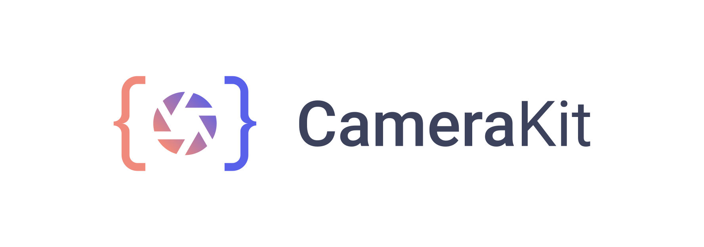
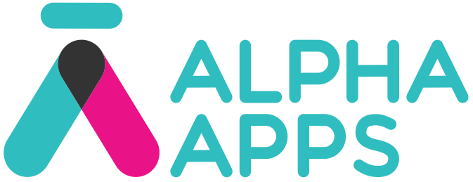

<p align="center">
    <a href="https://camerakit.io" target="_blank">
        
    </a>
</p>

<p align="center">
    <a href="https://play.google.com/store/apps/details?id=com.wonderkiln.camerakit.demo" target="_blank">
        
    </a>
        <a href="https://spectrum.chat/camerakit/">
        
    </a>
    <a href="https://buddy.works/" target="_blank">
        
    </a>
</p>

CameraKit helps you add reliable camera to your app quickly. Our open source camera platform provides consistent capture results, service that scales, and endless camera possibilities.

With CameraKit you are able to effortlessly do the following: 

- Image and video capture seamlessly working with the same preview session.
- Automatic system permission handling.
- Automatic preview scaling.
  - Create a `CameraView` of any size (not just presets!).
  - Automatic output cropping to match your `CameraView` bounds.
- Multiple capture methods.
  - `METHOD_STANDARD`: an image captured normally using the camera APIs.
  - `METHOD_STILL`: a freeze frame of the `CameraView` preview (similar to SnapChat and Instagram) for devices with slower cameras.
  - `METHOD_SPEED`: automatic capture method determination based on measured speed.
- Built-in continuous focus.
- Built-in tap to focus.
- Built-in pinch to zoom.

## Sponsored By
<a href="https://www.expensify.com/"></a>
<a href="https://www.buddy.works/"></a>


## Trusted By
<a href="https://www.infitting.com/"></a>
<a href="https://www.goosechase.com/"></a>
<a href="https://www.alpha-apps.ae/"></a>
<a href="https://www.expensify.com/"></a>

&nbsp;

# Get The Most From CameraKit
There are currently two versions of CameraKit that we support, `v1.0.0-beta3.X` and `v0.13.X`. 

If photo is your only need, try out the latest and greatest CameraKit features with `v1.0.0-beta3.11`. Our `beta3.11` release does not yet support video, but that feature is coming! 

In the meantime, if your application requires video we reccomend sticking with `v0.13.4`; the latest stable release with video implementation.


| Use Case | Version | Notes | Documentation Link |
| --- | --- | --- | --- |
| Photo only | `v1.0.0-beta3.11` | The latest and greatest CameraKit has to offer. Video support coming soon! | [camerakit.io/docs/beta3.11](https://camerakit.io/docs?v=1.0.0-beta3.10) |
| Photo and Video | `v0.13.4` | Stable build with full photo and video support | [camerakit.io/docs/0.13.4](https://camerakit.io/docs?v=0.13.2) |


## Documentation Site
Setup instructions for `1.0.0-beta3.11` are below. To see the full documentation head over to our website, [camerakit.io/docs](https://camerakit.io/docs).


## Setup
To include __CameraKit__ in your project, add the following to your `app` level `build.gradle`.
```java
dependencies {
    implementation 'com.camerakit:camerakit:1.0.0-beta3.11'
    implementation 'com.camerakit:jpegkit:0.1.0'
    implementation 'org.jetbrains.kotlin:kotlin-stdlib-jdk7:1.3.0'
    implementation 'org.jetbrains.kotlinx:kotlinx-coroutines-android:1.0.0'
}
```
## Usage
Create a `CameraKitView` in your layout as follows:
```
<com.camerakit.CameraKitView
    android:id="@+id/camera"
    android:layout_width="match_parent"
    android:layout_height="wrap_content"
    android:adjustViewBounds="true"
    android:keepScreenOn="true"   <!-- keep screen awake while CameraKitView is active -->
    app:camera_flash="auto"
    app:camera_facing="back"
    app:camera_focus="continuous"
    app:camera_permissions="camera" />
```

Then create a new `CameraKitView` object in your `Activity` and override the following methods.
```java
private CameraKitView cameraKitView;

@Override
protected void onCreate(Bundle savedInstanceState) {
    super.onCreate(savedInstanceState);
    setContentView(R.layout.activity_main);
    cameraKitView = findViewById(R.id.camera);
}

@Override
protected void onStart() {
    super.onStart();
    cameraKitView.onStart();
}

@Override
protected void onResume() {
    super.onResume();
    cameraKitView.onResume();
}

@Override
protected void onPause() {
    cameraKitView.onPause();
    super.onPause();
}

@Override
protected void onStop() {
    cameraKitView.onStop();
    super.onStop();
}

@Override
public void onRequestPermissionsResult(int requestCode, String[] permissions, int[] grantResults) {
    super.onRequestPermissionsResult(requestCode, permissions, grantResults);
    cameraKitView.onRequestPermissionsResult(requestCode, permissions, grantResults);
}
```
## ProGuard
If using ProGuard, add the following rules:
```
-dontwarn com.google.android.gms.**
-keepclasseswithmembers class com.camerakit.preview.CameraSurfaceView {
    native <methods>;
}
```

## License
CameraKit is [MIT License](https://github.com/CameraKit/CameraKit-Android/blob/master/LICENSE)
